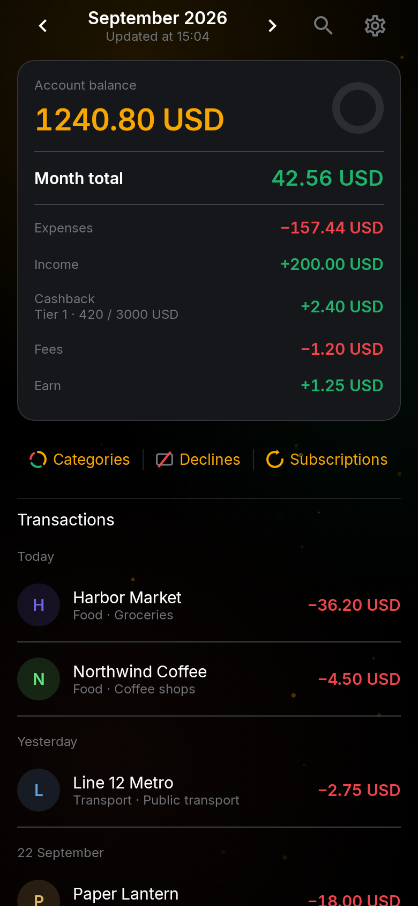
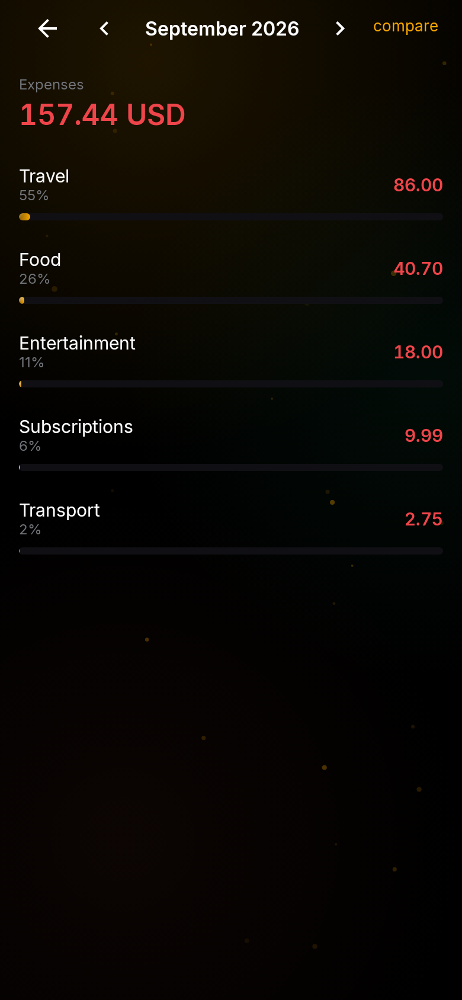
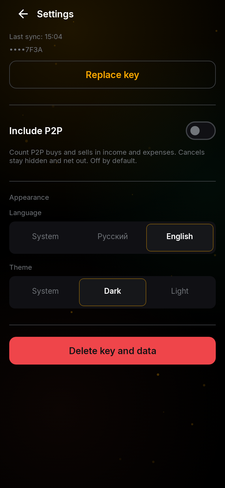

# CardTrack

On-device tracker for a Bybit Card. The app syncs card, transfer, and funding history from the Bybit API and stores it on the phone, so you can browse months, categories, declines, and recurring charges without an account on any CardTrack server.

This project is not affiliated with Bybit. Bybit's API terms and regional limits still apply (a US or mainland China IP often gets HTTP 403).

API keys never leave the device. See [docs/PRIVACY.md](docs/PRIVACY.md).

## Screenshots

Sample merchants and amounts. The phone language can be Russian; switch it in Settings.

<p>
  
  
  
</p>

## Install

Download [CardTrack.apk](https://github.com/falword/bybit-card-tracker/releases/latest/download/CardTrack.apk). Each push to `main` replaces that file with a newly signed build. It needs Android 8.0 or newer. Open the file and allow installation from the browser or files app when Android asks. This is not a Play Store listing.

Installing a newer APK over the previous one keeps the app data, because every published build uses the same signing key. The key stays out of git. See [docs/RELEASE.md](docs/RELEASE.md). The release notes include the commit and the SHA-256 of that build.

## Features

- Month ledger: expenses, income, cashback, fees, and account balance (Funding plus Flexible Easy Earn).
- Categories, including a parent category when no subcategory fits, and a month-by-month breakdown.
- Search by merchant, amount, MCC, or id, with date and amount filters.
- Declined charges, kept out of expenses.
- Subscriptions: monthly repeats and purchases filed under subscriptions, streaming, software, or media.
- Card purchases, refunds, top-ups, cashback, Bybit QR payments, and optional P2P (off by default).
- Easy Earn yield when the API key also has the Earn permission.
- English and Russian, light and dark theme. The default follows the phone.
- CSV export, and a Koinly export for purchases, refunds, and top-ups.
- Lock screen: the Bybit key is stored only after the phone has a PIN, password, or fingerprint.
- Settings can delete the key and local history from this device.

History is about the last 12 months. Sync is pull-down on the home list.

## Requirements

- Android 8.0 or newer (API 26).
- JDK 17, to build.
- A Bybit **main account** (not a subaccount) and a read-only API key. See below.
- A phone lock screen. CardTrack will not save a key without one.

## Build and install

```bash
export JAVA_HOME=/opt/homebrew/opt/openjdk@17
export PATH="$JAVA_HOME/bin:$PATH"
./gradlew :app:assembleDebug
```

The debug APK is `app/build/outputs/apk/debug/app-debug.apk`. Install it with Android Studio or:

```bash
adb install -r app/build/outputs/apk/debug/app-debug.apk
```

Release signing is local only. Unsigned `assembleRelease` still succeeds when the keystore is unset. See [docs/RELEASE.md](docs/RELEASE.md).

Do not commit `local.properties`, keystores, or API keys.

## Bybit API key

Create the key on the Bybit website in a browser. The Bybit app has no API section. If the account is younger than 48 hours, Bybit may block key creation.

1. Sign in to the main account (not a subaccount). Open the profile menu → API, or [API Management](https://www.bybit.com/app/user/api-management).
2. Create New Key → **System-generated API Keys (HMAC)**. Not RSA, and not a third-party app key.
3. Set **Read-only**.
4. Enable **Bybit Card** and **Wallet → Account Transfer**. Leave trading, Withdraw, and subaccounts off.
5. Leave IP restriction empty. A phone's address changes, and Bybit will reject the key.
6. Confirm 2FA. Copy the API Key and Secret immediately — the secret is shown once — and paste both into CardTrack.

Earn is optional. Without it, yield history is skipped; the key can still be saved.

After you stop using the app, revoke the key in Bybit → API as well as deleting it in CardTrack settings.

## Tests

```bash
./gradlew test
```

GitHub Actions runs `./gradlew test lintRelease assembleRelease` on each push and pull request (`.github/workflows/ci.yml`).

## Project layout

| Path | What it is |
| --- | --- |
| `app/` | Android UI, Room database, keystore. |
| `core/` | Bybit client, sync, and domain logic. Pure JVM, so unit tests do not need a device. |
| `docs/screenshots/` | README images of the month, categories, and settings screens. |
| `docs/PRIVACY.md` | What stays on the phone. |
| `docs/RELEASE.md` | How pushes to `main` publish a signed APK without committing the keystore. |
| `docs/bybit-api/` | Which Bybit endpoints this app calls, and the limits it follows. |

The full official V5 markdown is not in this repository. [docs/bybit-api/README.md](docs/bybit-api/README.md) explains how to clone it locally before changing a request.

## License

[MIT](LICENSE).

## Русский

CardTrack — трекер карты Bybit на самом телефоне. Приложение забирает операции карты, переводы и funding из API Bybit и хранит их локально: месяцы, категории, отказы и повторяющиеся списания. Сервера CardTrack нет, ключ с устройства не уходит. Подробности: [docs/PRIVACY.md](docs/PRIVACY.md).

Это не официальное приложение Bybit. Снимки экрана — в начале страницы. Суммы на них выдуманные. Язык интерфейса переключается в настройках, в том числе на русский.

**Установка.** Скачайте [CardTrack.apk](https://github.com/falword/bybit-card-tracker/releases/latest/download/CardTrack.apk). Каждый push в `main` заменяет этот файл новой подписанной сборкой. Нужен Android 8.0+. Откройте файл и разрешите установку, когда Android спросит. Это не страница в Play Store. Новая сборка ставится поверх и сохраняет данные: все публичные сборки подписаны одним ключом.

**Сборка.** Нужен JDK 17 и Android 8.0+.

```bash
export JAVA_HOME=/opt/homebrew/opt/openjdk@17
export PATH="$JAVA_HOME/bin:$PATH"
./gradlew :app:assembleDebug
```

APK: `app/build/outputs/apk/debug/app-debug.apk`. Подпись релиза — [docs/RELEASE.md](docs/RELEASE.md). Не коммитьте `local.properties`, keystore и API-ключи.

**Ключ.** Только основной аккаунт, не субаккаунт. На сайте Bybit: Create New Key → System-generated (HMAC) → Read-only → права **Bybit Card** и **Wallet → Account Transfer**. Без торговли, Withdraw и ограничения по IP. Секрет показывают один раз. Earn нужен только для доходности Easy Earn.

**Что умеет.** Месяц (расходы, доходы, кэшбек, комиссии, баланс Funding + Flexible Easy Earn), категории, поиск, отказы, подписки, QR Bybit, P2P по желанию (выключен по умолчанию), русский и английский, светлая и тёмная тема, экспорт CSV и Koinly, удаление ключа и истории в настройках. История — примерно 12 месяцев. Синхронизация — потянуть список на главной вниз.
